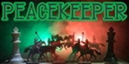

*Solitudinem faciunt, pacem appellant*  
They make a desert and call it peace  
**- Tacitus**

## Peacekeeper

A fairly strong and probably [superhuman](https://dokumen.tips/documents/the-level-of-play-in-ccrl-and-fide-rating-vs-fidepdfthe-level-of-play-in-ccrl-and.html) UCI Chess Engine, written in C++17.

Achieved top 100 in [CCRL Blitz](https://web.archive.org/web/20230918233014/http://ccrl.chessdom.com/ccrl/404/cgi/compare_engines.cgi?class=Single-CPU+engines&only_best_in_class=on&num_best_in_class=1&print=Rating+list&profile_step=50&profile_numbers=1&print=Results+table&print=LOS+table&table_size=100&ct_from_elo=0&ct_to_elo=10000&match_length=30&cross_tables_for_best_versions_only=1&sort_tables=by+rating&diag=0&reference_list=None&recalibrate=no) and [CCRL 40/15](https://web.archive.org/web/20230916145417/http://ccrl.chessdom.com/ccrl/4040/cgi/compare_engines.cgi?class=Single-CPU+engines&only_best_in_class=on&num_best_in_class=1&print=Rating+list&profile_step=50&profile_numbers=1&print=Results+table&print=LOS+table&table_size=100&ct_from_elo=0&ct_to_elo=10000&match_length=30&cross_tables_for_best_versions_only=1&sort_tables=by+rating&diag=0&reference_list=None&recalibrate=no) with hand crafted evaluation (HCE).

### Engine Issues

Issues on github can be created for any bugs, other issues found, or questions.

### Compilation

Peacekeeper can be compiled from source with GNU C++ or Clang with `g++ -Ofast -DNDEBUG -march=native -o peacekeeper src/*.cpp`
MSVC intrinsics are supported as well as C++20 bit intrinsics, so the engine can in theory be compiled on a large range of compilers.

Windows (and formerly linux) executables are provided for each release in the [Releases](https://github.com/Sazgr/peacekeeper/releases) section.

### Ratings

\* denotes a version which has not been tested on that rating list and does not have a rating.

Ratings prefixed with ~ have large error margins because of few games played.

Note that ratings from different rating lists are not comparable to each other.

Version | CCRL Blitz | CCRL 40/15 | CCRL FRC | CEGT 40/4 | CEGT 40/20
--------|------------|------------|----------|-----------------------
v1.10   | 2385       | 2347       | *        | *         | *
v1.20   | 2509       | 2450       | *        | *         | *
v1.30   | 2600       | 2594       | *        | *         | *
v1.40   | 2697       | 2694       | *        | *         | *
v1.50   | 2790       | 2772       | *        | *         | *
v1.60   | 3043       | 3013       | *        | 2872      | *
v1.7x   | 3095       | 3049       | 2996     | 2929      | *
v2.00   | *          | 3285       | 3529     | 3194      | *
v2.10   | 3392       | 3337       | 3599     | 3274      | 3253
v2.20   | 3468       | 3393       | 3685     | 3337      | *
v2.30   | 3521       | 3427       | 3754     | *         | 3372

### Features

This is a list of features I have implemented so far in Peacekeeper. It may be incomplete or outdated at times.

- Board Representation and Move Generation
    - Bitboard-based
    - Redundant Mailbox Board
    - Make-Unmake
    - Fixed-shift Fancy Magic Bitboards for slider move generation
    - Fully legal move generation
    - Supports Fischer Random Chess (FRC) and Double Fischer Random Chess (DFRC)
- Search
    - Supports LazySMP, can use up to 256 threads in parallel
    - Negamax framework
    - Principal Variation Search (PVS)
    - Quiescence Search (QS)
        - QS SEE Pruning
    - Iterative Deepening
        - Aspiration Windows
    - Staged Move Generation
        - Hash move
        - Captures
        - Quiets
    - Time Management
        - Soft and Hard Bounds
        - More time for unstable bestmoves
    - Transposition Table
        - Incrementally updated Zobrist hash
        - Used in both QS and PVS
    - Selectivity
        - Check Extensions
        - Static Null Move Pruning/Reverse Futility Pruning (SNMP/RFP)
        - Null Move Pruning (NMP)
        - Late Move Reductions (LMR)
        - Late Move Pruning (LMP)
        - Futility Pruning
        - SEE Pruning
        - Internal Iterative Reductions (IIR)
    - Move Ordering
        - MVV-LVA for captures
        - Killer Heuristic
        - History Heuristic for quiet moves
        - Continuation and Countermoves History
- Evaluation
    - Efficiently Updatable Neural Network (NNUE)
        - Used in version 2.00 and after
        - Tuned using modified version of Slender's Carbon trainer
        - 768->512x2->1 architecture
            - Clipped ReLU (CReLU) activation function
            - Perspective network
        - Trained on selfplay DFRC data
    - Hand-Crafted
        - Used in version 1.71 and before
        - Texel Tuned using Gradient Descent tuner
            - ADAM algorithm
        - King-Relative Piece Square Tables
        - Pawn structure
            - Passed Pawns
            - Free Passed Pawns
            - Doubled Pawns
            - Isolated Pawns
            - Supported Pawns
            - Pawn Phalanxes
        - Mobility
            - Regular mobility
            - Forward mobility
        - Bishop Pair
        - Open and Semi-Open Files
        - Tapered Eval
        - Tempo Bonus
            - Phase dependent
        - Contempt
            - Phase dependent

### Credits & Thanks
In no particular order.

- Pradu Kannan for magic multipliers
- CPW (and Sungorus) for zobrist hash pseudorandom number generator
- The [Chess Programming Wiki](https://www.chessprogramming.org) for being a great resource for everything related to chess programming
- The [Talkchess](https://talkchess.com) forum and the people on it for answering my more specific questions
- The Engine Programming Discord and the people on it
- Slender (@rafid-dev) especially for coinhabiting an OpenBench instance, contributing hardware mutually, and sharing SSS test results
- @Witek902 for tons of hardware and hosting an OpenBench instance, and @gab8192
- Andrew Zhuo (@StackFish5) for constantly looking over my code
- @albert-wastakentoomuch, @ccao25 for help in generating data
- PeSTO for starter piece square tables
- [Chess cache](https://www.chesscache.com/ChessEngines.html) (Dusan Stamenkovic) and Graham from CCRL for logos
- Some engines which I got inspiration from (in alphabetical order) along with their authors:
    - [Altair](https://github.com/Alex2262/AltairChessEngine)
    - [Blunder](https://github.com/algerbrex/blunder)
    - [Leorik](https://github.com/lithander/Leorik)
    - [Midnight](https://github.com/archishou/MidnightChessEngine)
    - [Pedantic](https://github.com/JoAnnP38/Pedantic)
    - [Polaris](https://github.com/Ciekce/Polaris)
    - [Rice](https://github.com/rafid-dev/rice)
    - [Stockfish](https://github.com/official-stockfish/Stockfish)
    - [Sunfish](https://github.com/thomasahle/sunfish)
    - [Willow](https://github.com/Adam-Kulju/Willow)
- Rating list testers for testing my engine
